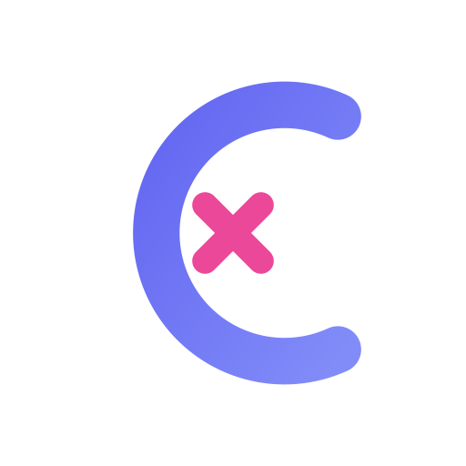

<div align="center">



# Crux

**Generate professional README + Logo in one workflow — no external API needed**

[](https://github.com/mocasus/crux/releases)
[](LICENSE)
[](https://github.com/mocasus/crux/actions)
[](#-skills)
[](#-why-crux)
[](https://github.com/mocasus/crux)

</div>

---

> Ever spent an hour writing a README, only to realize it's missing a logo, has no badges, and looks bare? **Crux fixes that in one command.** Three skills that detect your project, generate 6+ logo variants, and build a scored README — all offline, no API keys.

## 📋 Table of Contents

- [Why Crux](#-why-crux)
- [✨ Features](#-features)
- [🚀 Quick Start](#-quick-start)
- [📖 Usage](#-usage)
- [📦 Skills](#-skills)
- [🏗️ Architecture](#️-architecture)
- [📊 Comparison](#-comparison)
- [🎨 Logo Design Principles](#-logo-design-principles)
- [🤝 Contributing](#-contributing)
- [🗺️ Roadmap](#️-roadmap)
- [📄 License](#-license)

## 🔍 Why Crux

Most README generators stop at templates. Crux goes further:

- **Logo + README in one pipeline** — not just text, full visual identity
- **6+ logo variants per request** — geometric, lettermark, symbolic, negative space, wordmark
- **Scoring system** — know exactly what your README is missing (Essential → Viral, 100 pts)
- **Zero external dependencies** — no API keys, no cloud calls, works offline
- **Agent-native** — designed for Hermes Agent and Claude Code, not just humans

## ✨ Features

**readme-author**
- Hook → Prove → Enable → Extend framework
- 4 operations: create, modify, validate (scored), optimize (virality)
- Auto-detects project type (Python, Node, Rust, Go, AI/ML, CLI, web app, bot)
- Scoring system: Essential (40%) / Professional (25%) / Elite (15%) / Virality (20%)
- Pain point narrative, tiered CTAs, social proof patterns
- Project-type templates: CLI, library, web app, AI/ML, bot
- Badge patterns, validation checklist, hero layout templates

**logo-author**
- 6+ SVG variants per request across 5 design directions
- 8 critical design principles with pre-finalization checklist
- Design pattern library: dot matrix, geometric shapes, line systems, node networks
- 12 showcase background styles (6 dark + 6 light)
- 6 WebGL shader backgrounds (LED Matrix, Fluid Warping, Fabric Wave, etc.)
- PNG export in 7 standard sizes (16px → 2048px) — 2 methods (Python + Shell)
- Interactive HTML showcase with React template
- Optional AI showcase via Gemini/Nano Banana (12 professional backgrounds)
- Iterative refinement workflow with favicon size verification

**readme-full**
- All-in-one pipeline: detect → logo → README → validate
- Chains logo-author + readme-author in a single workflow
- 5-phase: Detect → Logo → Refine → Generate README → Score
- Same scoring system (Essential → Viral, 100 points)
- All scripts, references, templates, and assets included

## 🚀 Quick Start

### Install

```bash
# Clone
git clone https://github.com/mocasus/crux.git

# Copy skills to Hermes
cp -r crux/skills/* ~/.hermes/skills/

# Or copy to Claude Code
cp -r crux/skills/* ~/.claude/skills/
```

### Use

```
# Ask the agent:
"Bikin README + logo untuk project saya"
"Generate a logo for my project called DataFlow"
"Create a README for my Python library"
"Validate my existing README and score it"
```

That's it. The agent loads the skill automatically and follows the workflow.

### PNG Export (Optional)

Logo export needs one of these:

```bash
pip install cairosvg                    # Python (recommended)
npm install -g @aspect-build/resvg      # Node.js
apt install librsvg2-bin                # Debian/Ubuntu
```

### AI Showcase (Optional)

For AI-generated showcase images on 12 professional backgrounds:

```bash
pip install google-genai
export GEMINI_API_KEY=your_key
```

## 📖 Usage

### Logo Workflow

1. **Interview** — product name, industry, core concept, color preference
2. **Generate** — 6+ SVG variants exploring 5 design directions
3. **Refine** — pick favorites, adjust colors/strokes/layout, check favicon
4. **Export** — SVG + PNG (7 sizes, 2 methods) + HTML showcase (12 backgrounds)
5. **Deliver** — optional README integration, favicon pack, social card

```bash
# Export PNGs (Python)
python skills/logo-author/scripts/svg_to_png.py logo.svg --all

# Export PNGs (Shell, auto-detects best tool)
bash skills/logo-author/scripts/export.sh logo.svg ./logos/

# Generate HTML showcase
python skills/logo-author/scripts/showcase.py logo.svg --output showcase.html

# AI showcase (optional, requires Gemini API)
python skills/logo-author/scripts/generate_showcase.py "MyApp" logo_512.png --all-styles
```

### README Workflow

1. **Detect** — language, entry points, test framework, CI, project type
2. **Select** — choose operation: create, modify, validate, or optimize
3. **Generate** — Hook → Prove → Enable → Extend sections
4. **Assemble** — badges, hero, quick start, architecture, CTAs
5. **Validate** — score against 4-tier checklist (Essential → Viral)

```
# Operations
"Create a README from scratch"
"Validate my README and give me a score"
"Optimize my README for maximum stars"
"Modify my README to add missing sections"
```

## 📦 Skills

| Skill | Description | Key Feature |
|-------|-------------|-------------|
| `readme-author` | Generate README.md with Hook → Prove → Enable → Extend | 4 operations + scoring system |
| `logo-author` | Generate SVG logos, export PNG, build showcase | 6+ variants + 12 backgrounds + 8 design principles |
| `readme-full` | All-in-one: detect → logo → README → validate | Single pipeline, self-contained |

## 🏗️ Architecture

```
crux/
├── logo.svg                        # Crux's own logo (dogfooded)
├── logo.png                        # 512×512 PNG for README
├── skills/
│   ├── readme-author/
│   │   ├── SKILL.md                # Hook → Prove → Enable → Extend + 4 operations
│   │   ├── scripts/
│   │   │   ├── detect_project.py   # Auto-detect language/type/metadata
│   │   │   └── select_operation.py # Analyze README → recommend operation
│   │   ├── references/
│   │   │   ├── badges-and-visuals.md    # Badge patterns, social proof, GIF demos
│   │   │   ├── validation-guide.md      # Scoring system + checklists (4 tiers)
│   │   │   └── project-types.md         # Templates: CLI, library, web app, AI/ML, bot
│   │   └── templates/
│   │       ├── badges.md           # Badge construction patterns
│   │       └── hero_layout.md      # 4 hero section layouts
│   │
│   ├── readme-full/
│   │   ├── SKILL.md                # All-in-one pipeline (detect → logo → README → validate)
│   │   ├── scripts/                # All 6 scripts (logo + readme combined)
│   │   ├── references/             # All 6 references (design patterns + validation)
│   │   ├── templates/              # Badge + hero templates
│   │   └── assets/                 # React showcase template
│   │
│   └── logo-author/
│       ├── SKILL.md                # 5-phase workflow + 8 design principles
│       ├── scripts/
│       │   ├── svg_to_png.py       # PNG export via cairosvg (Python)
│       │   ├── export.sh           # Multi-tool PNG export (resvg/sharp/inkscape/rsvg)
│       │   ├── showcase.py          # Static HTML showcase generator
│       │   └── generate_showcase.py # AI showcase via Gemini/Nano Banana
│       ├── references/
│       │   ├── design_patterns.md      # SVG pattern library (dot matrix, geometric, lines, nodes)
│       │   ├── background_styles.md     # 12 showcase backgrounds (6 dark + 6 light)
│       │   └── webgl_backgrounds.md     # 6 WebGL shader backgrounds
│       └── assets/
│           └── showcase_template.html  # React interactive showcase template
│
├── logos/                          # Variants + showcase from logo design
└── .github/
    └── workflows/
        └── ci.yml                  # Validate SKILL.md + Python scripts
```

## 📊 Comparison

| Feature | Crux | Manual README | AI Generators | README Templates |
|---------|------|---------------|---------------|------------------|
| Logo generation | ✅ 6+ SVG variants | ❌ | ⚠️ Sometimes | ❌ |
| README scoring | ✅ 100-pt system | ❌ | ❌ | ❌ |
| Works offline | ✅ No API needed | ✅ | ❌ | ✅ |
| Agent-native | ✅ Hermes + Claude | ❌ | ❌ | ❌ |
| PNG export (7 sizes) | ✅ | ❌ | ⚠️ | ❌ |
| HTML showcase | ✅ 12 backgrounds | ❌ | ❌ | ❌ |
| Project type detection | ✅ Auto | ❌ | ⚠️ | ❌ |
| Customizable framework | ✅ Hook→Prove→Enable→Extend | ❌ | ❌ | ⚠️ Static |

## 🎨 Logo Design Principles

1. **Extreme Simplicity** — 1–2 core elements max
2. **Generous Negative Space** — 40–50% empty canvas
3. **Precise Proportions** — Line weights 2.5–4px
4. **Visual Tension** — Intentional asymmetry
5. **Single Focal Point** — Clear visual hierarchy
6. **Restraint Over Decoration** — Justify every element
7. **Structural Stability** — Dense lines or thick strokes, never fragile
8. **Rounded Cuts** — Negative space openings must be rounded

## 🤝 Contributing

PRs welcome. Areas to contribute:

- New logo variant styles (beyond the 5 default directions)
- New showcase background styles (CSS or WebGL)
- README templates for specific project types (CLI, web app, bot)
- Additional SVG-to-PNG exporter support
- New design patterns for the reference library

## 🗺️ Roadmap

- [ ] Dark/light logo variants auto-generated from single source
- [ ] Social card generator (1200×630px)
- [ ] Favicon pack export (ICO + PNG + Apple touch icon)
- [ ] Animated SVG logo variants
- [ ] More project-type templates (Rust, Go, Docker)

## 📄 License

[MIT](LICENSE) — free for personal and commercial use.

---

<div align="center">

**v1.0.0** · Made with care for developers who ship fast.

</div>
